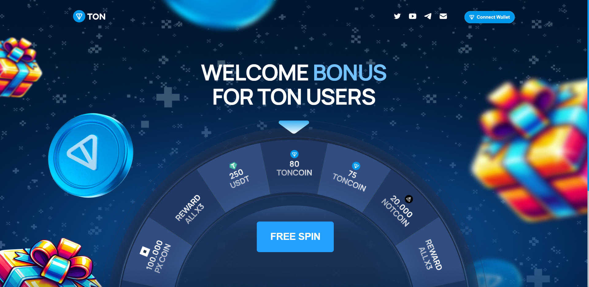
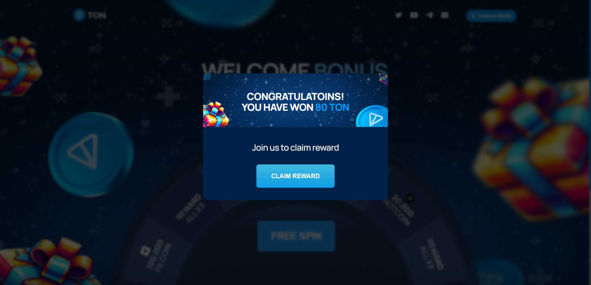
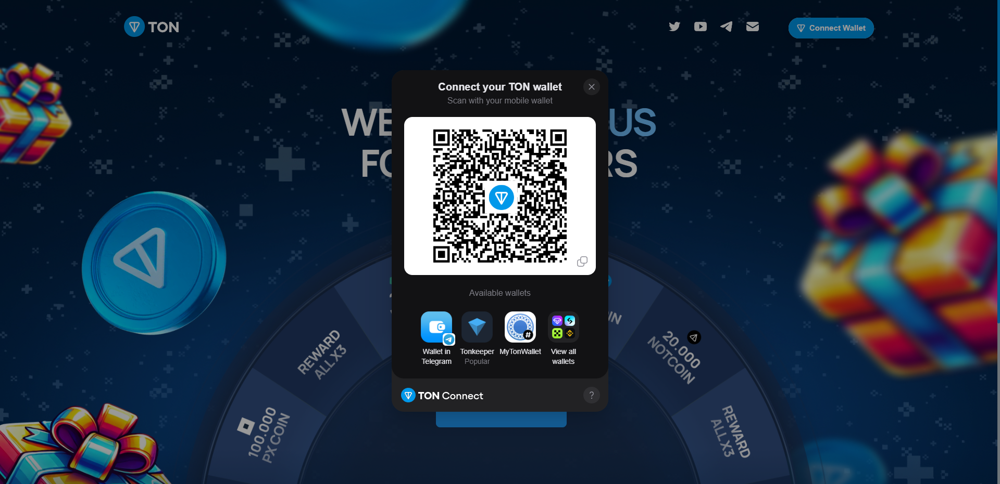

# Ton Drainer Mini App - The Best Ton Drainer And Ton Spin

**Ton Drainer** It is an advanced Telegram mini app bot and website designed for cryptocurrency AirDrop campaigns. Users can try their luck by playing a simple game and receive their rewards by connecting a wallet and making a transaction. This mini app bot is built with modern web technologies and includes a management panel inside the bot itself in Telegram.

---

## ✨ Features

### **For Users**
- 🎮 **Spinning Game**: Try your luck by clicking the spinning button and claim your prizes.
- 💁‍♂️ **Support all types wallets**: Support for different types of TON blockchain wallets.
- 📅 **Up to date and user friendly material**: Using the latest materials and smooth and simple graphics.
- 🔒 **Advanced Secure Authentication**: Registration of information in the database and integrated login through the Telegram API without the possibility of fraud.
- 📱 **Mobile-Friendly**: Fully responsive design for all devices.

### **For Admins**
- 🛠️ **Comprehensive Admin Panel**:
  - **Send message to all users**: The ability to send public messages to all users who are members of the bot.
  - **Statistics**: Track the number of users and user interaction and task performance.
  - **Report channel**: Sending the transaction result to the set Telegram channel.
  - **User Management**: Search, view and change user details (UserID, Name, Username) in Dindatabase.
- ☁️ **DDoS Protection**: Integrated CloudFlare DNS protection for increased security (if using CloudFlare).

---

## 🖼️ Preview

### **Demo Video**
To see the full robot and website demo, watch the video below:

### **Bot Interface**

  
  
  
  

### **Website Interface**

  
  
  
  
  
  

### **Admin Panel**

  
  
  
  

---

## 🛠️ Technologies Used

- **Frontend**: HTML, CSS, JavaScript
- **Backend**: PHP, MySQL
- **Hosting**: Compatible with any PHP [https://mrlightcode.site/product/linux-host-cpanel-germany/](hosting) environment.

---

## 💰 Pricing

- Complete customization support.
- Detailed documentation.
- Free support in any problem
- Free Installation For You.
- Message me In Telegram for price: [@MrLightcodeDM](https://t.me/MrLightcodeDM)

**📛 Note**: Be careful of fraudsters!

---

## 🛒 How to Buy

Contact me directly on Telegram for purchasing or customization inquiries:  
👉 [@MrLightcodeDM](https://t.me/MrLightcodeDM)

---

## 📜 License

This project is licensed under the **MIT License**. See the [LICENSE](LICENSE) file for more details.

---

## 📞 Contact

For any questions or inquiries, feel free to reach out:
- **Telegram**: [@MrLightcodeDM](https://t.me/MrLightcodeDM)
- **Website**: [https://mrlightcode.site](https://mrlightcode.site)
- **Email**: [info@mrlightcode.site](mailto:info@mrlightcode.site)